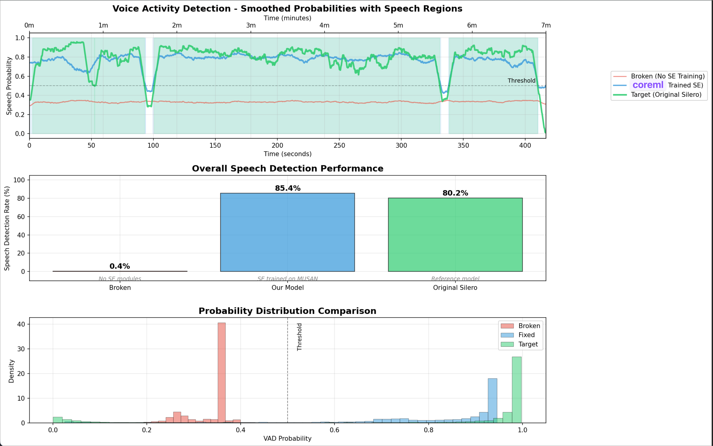

## Transcription

https://huggingface.co/FluidInference/parakeet-tdt-0.6b-v3-coreml 

```bash
swift run fluidaudio fleurs-benchmark --languages en_us,it_it,es_419,fr_fr,de_de,ru_ru,uk_ua --samples all
```

```text
================================================================================
FLEURS BENCHMARK SUMMARY
================================================================================

Language                  | WER%   | CER%   | RTFx    | Duration | Processed | Skipped
-----------------------------------------------------------------------------------------
English (US)              | 5.7    | 2.8    | 136.7   | 3442.9s  | 350       | -
French (France)           | 5.8    | 2.4    | 136.5   | 560.8s   | 52        | 298
German (Germany)          | 3.1    | 1.2    | 152.2   | 62.1s    | 5         | -
Italian (Italy)           | 4.3    | 2.0    | 153.7   | 743.3s   | 50        | -
Russian (Russia)          | 7.7    | 2.8    | 134.1   | 621.2s   | 50        | -
Spanish (Spain)           | 6.5    | 3.0    | 152.3   | 586.9s   | 50        | -
Ukrainian (Ukraine)       | 6.5    | 1.9    | 132.5   | 528.2s   | 50        | -
-----------------------------------------------------------------------------------------
AVERAGE                   | 5.6    | 2.3    | 142.6   | 6545.5s  | 607       | 298
```

```text
2620 files per dataset • Test runtime: 4m 1s • 09/04/2025, 1:55 AM EDT
--- Benchmark Results ---
   Dataset: librispeech test-clean
   Files processed: 2620
   Average WER: 2.7%
   Median WER: 0.0%
   Average CER: 1.1%
   Median RTFx: 99.3x
   Overall RTFx: 109.6x (19452.5s / 177.5s)
```

## Voice Activity Detection



Dataset: https://github.com/Lab41/VOiCES-subset

```text
swift run fluidaudio vad-benchmark --dataset voices-subset --all-files --threshold 0.5
...
⏱️ Timing Statistics:
[23:26:10.167] [INFO] [VAD]    Total processing time: 2.76s
[23:26:10.167] [INFO] [VAD]    Total audio duration: 350.46s
[23:26:10.167] [INFO] [VAD]    RTFx: 126.9x faster than real-time
[23:26:10.167] [INFO] [VAD]    Audio loading time: 0.01s (0.2%)
[23:26:10.167] [INFO] [VAD]    VAD inference time: 2.75s (99.7%)
[23:26:10.167] [INFO] [VAD]    Average per file: 0.115s
[23:26:10.167] [INFO] [VAD]    Min per file: 0.022s
[23:26:10.167] [INFO] [VAD]    Max per file: 0.135s
[23:26:10.167] [INFO] [VAD]
📊 VAD Benchmark Results:
[23:26:10.167] [INFO] [VAD]    Precision: 100.0%
[23:26:10.167] [INFO] [VAD]    Accuracy: 100.0%
[23:26:10.167] [INFO] [VAD]    Recall: 100.0%
[23:26:10.167] [INFO] [VAD]    F1-Score: 100.0%
[23:26:10.167] [INFO] [VAD]    Total Time: 2.76s
[23:26:10.167] [INFO] [VAD]    RTFx: 126.9x faster than real-time
[23:26:10.167] [INFO] [VAD]    Files Processed: 24
[23:26:10.167] [INFO] [VAD]    Avg Time per File: 0.115s
```


## Speaker Diarization