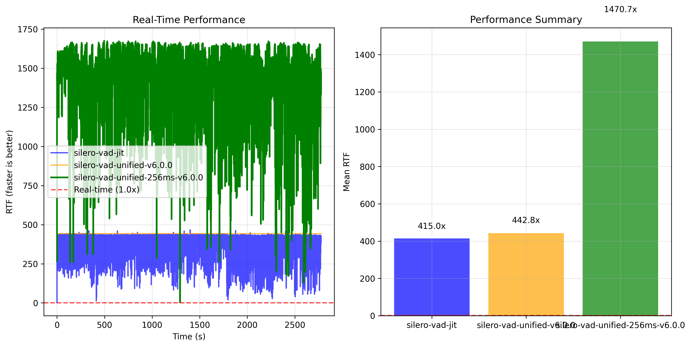
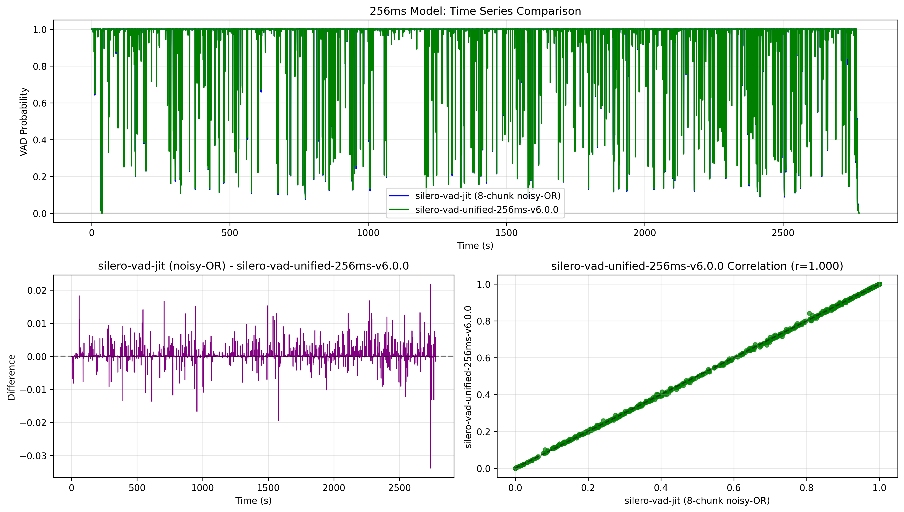

# Benchmarks

2024 MacBook Pro, 48GB Ram, M4 Pro, Tahoe 26.0

## Transcription

https://huggingface.co/FluidInference/parakeet-tdt-0.6b-v3-coreml 

```bash
swift run fluidaudio fleurs-benchmark --languages en_us,it_it,es_419,fr_fr,de_de,ru_ru,uk_ua --samples all
```

```text
[01:58:26.666] [INFO] [FLEURSBenchmark] ================================================================================
[01:58:26.666] [INFO] [FLEURSBenchmark] FLEURS BENCHMARK SUMMARY
[01:58:26.666] [INFO] [FLEURSBenchmark] ================================================================================
[01:58:26.666] [INFO] [FLEURSBenchmark]
[01:58:26.666] [INFO] [FLEURSBenchmark] Language                  | WER%   | CER%   | RTFx    | Duration | Processed | Skipped
[01:58:26.666] [INFO] [FLEURSBenchmark] -----------------------------------------------------------------------------------------
[01:58:26.666] [INFO] [FLEURSBenchmark] English (US)              | 5.7    | 2.8    | 197.8   | 3442.9s  | 350       | -
[01:58:26.666] [INFO] [FLEURSBenchmark] French (France)           | 6.3    | 3.0    | 191.3   | 560.8s   | 52        | 298
[01:58:26.667] [INFO] [FLEURSBenchmark] German (Germany)          | 3.1    | 1.2    | 216.7   | 62.1s    | 5         | -
[01:58:26.667] [INFO] [FLEURSBenchmark] Italian (Italy)           | 4.3    | 2.0    | 213.5   | 743.3s   | 50        | -
[01:58:26.667] [INFO] [FLEURSBenchmark] Russian (Russia)          | 7.8    | 2.8    | 186.3   | 621.2s   | 50        | -
[01:58:26.667] [INFO] [FLEURSBenchmark] Spanish (Spain)           | 5.6    | 2.7    | 214.6   | 586.9s   | 50        | -
[01:58:26.667] [INFO] [FLEURSBenchmark] Ukrainian (Ukraine)       | 7.2    | 2.1    | 192.8   | 528.2s   | 50        | -
[01:58:26.667] [INFO] [FLEURSBenchmark] -----------------------------------------------------------------------------------------
[01:58:26.667] [INFO] [FLEURSBenchmark] AVERAGE                   | 5.7    | 2.4    | 201.9   | 6545.5s  | 607       | 298
```

```text
[02:01:49.655] [INFO] [Benchmark] 2620 files per dataset • Test runtime: 3m 2s • 09/25/2025, 2:01 AM EDT
[02:01:49.655] [INFO] [Benchmark] --- Benchmark Results ---
[02:01:49.655] [INFO] [Benchmark]    Dataset: librispeech test-clean
[02:01:49.655] [INFO] [Benchmark]    Files processed: 2620
[02:01:49.655] [INFO] [Benchmark]    Average WER: 2.6%
[02:01:49.655] [INFO] [Benchmark]    Median WER: 0.0%
[02:01:49.655] [INFO] [Benchmark]    Average CER: 1.1%
[02:01:49.655] [INFO] [Benchmark]    Median RTFx: 137.8x
[02:01:49.655] [INFO] [Benchmark]    Overall RTFx: 153.4x (19452.5s / 126.8s)
[02:01:49.655] [INFO] [Benchmark] Results saved to: asr_benchmark_results.json
[02:01:49.655] [INFO] [Benchmark] ASR benchmark completed successfully
```

`swift run fluidaudio asr-benchmark --max-files all --model-version v2`

Use v2 if you only need English, it is a bit more accurate

```text
ansient day, like music in the air. Ah
[01:35:16.880] [INFO] [Benchmark] File: 908-157963-0010.flac (WER: 15.4%) (Duration: 6.28s)
[01:35:16.880] [INFO] [Benchmark] ------------------------------------------------------------
[01:35:16.894] [INFO] [Benchmark] Normalized Reference: she ceasd and smild in tears then sat down in her silver shrine
[01:35:16.894] [INFO] [Benchmark] Normalized Hypothesis:        she ceased and smiled in tears then sat down in her silver shrine
[01:35:16.894] [INFO] [Benchmark] Original Hypothesis:  She ceased and smiled in tears, Then sat down in her silver shrine,
[01:35:16.894] [INFO] [Benchmark] 2620 files per dataset • Test runtime: 3m 25s • 09/26/2025, 1:35 AM EDT
[01:35:16.894] [INFO] [Benchmark] --- Benchmark Results ---
[01:35:16.894] [INFO] [Benchmark]    Dataset: librispeech test-clean
[01:35:16.894] [INFO] [Benchmark]    Files processed: 2620
[01:35:16.894] [INFO] [Benchmark]    Average WER: 2.2%
[01:35:16.894] [INFO] [Benchmark]    Median WER: 0.0%
[01:35:16.894] [INFO] [Benchmark]    Average CER: 0.7%
[01:35:16.894] [INFO] [Benchmark]    Median RTFx: 125.6x
[01:35:16.894] [INFO] [Benchmark]    Overall RTFx: 141.2x (19452.5s / 137.7s)
[01:35:16.894] [INFO] [Benchmark] Results saved to: asr_benchmark_results.json
[01:35:16.894] [INFO] [Benchmark] ASR benchmark completed successfully
```

### ASR Model Compilation

Core ML first-load compile times captured on iPhone 16 Pro Max and iPhone 13 running the
parakeet-tdt-0.6b-v3-coreml bundle. Cold-start compilation happens the first time each Core ML model
is loaded; subsequent loads hit the cached binaries. Warm compile metrics were collected only on the
iPhone 16 Pro Max run, and only for models that were reloaded during the session.

| Model         | iPhone 16 Pro Max cold (ms) | iPhone 16 Pro Max warm (ms) | iPhone 13 cold (ms) | Compute units               |
| ------------- | --------------------------: | ---------------------------: | ------------------: | --------------------------- |
| Preprocessor  |                        9.15 |                           - |              632.63 | MLComputeUnits(rawValue: 2) |
| Encoder       |                     3361.23 |                      162.05 |             4396.00 | MLComputeUnits(rawValue: 1) |
| Decoder       |                       88.49 |                        8.11 |              146.01 | MLComputeUnits(rawValue: 1) |
| JointDecision |                       48.46 |                        7.97 |               71.85 | MLComputeUnits(rawValue: 1) |

## Voice Activity Detection

Model is nearly identical to the base model in terms of quality, perforamnce wise we see an up to ~3.5x improvement compared to the silero Pytorch VAD model with the 256ms batch model (8 chunks of 32ms)




Dataset: https://github.com/Lab41/VOiCES-subset

```text
swift run fluidaudio vad-benchmark --dataset voices-subset --all-files --threshold 0.85
...
Timing Statistics:
[18:56:31.208] [INFO] [VAD]    Total processing time: 0.29s
[18:56:31.208] [INFO] [VAD]    Total audio duration: 351.05s
[18:56:31.208] [INFO] [VAD]    RTFx: 1230.6x faster than real-time
[18:56:31.208] [INFO] [VAD]    Audio loading time: 0.00s (0.6%)
[18:56:31.208] [INFO] [VAD]    VAD inference time: 0.28s (98.7%)
[18:56:31.208] [INFO] [VAD]    Average per file: 0.011s
[18:56:31.208] [INFO] [VAD]    Min per file: 0.001s
[18:56:31.208] [INFO] [VAD]    Max per file: 0.020s
[18:56:31.208] [INFO] [VAD]
VAD Benchmark Results:
[18:56:31.208] [INFO] [VAD]    Accuracy: 96.0%
[18:56:31.208] [INFO] [VAD]    Precision: 100.0%
[18:56:31.208] [INFO] [VAD]    Recall: 95.8%
[18:56:31.208] [INFO] [VAD]    F1-Score: 97.9%
[18:56:31.208] [INFO] [VAD]    Total Time: 0.29s
[18:56:31.208] [INFO] [VAD]    RTFx: 1230.6x faster than real-time
[18:56:31.208] [INFO] [VAD]    Files Processed: 25
[18:56:31.208] [INFO] [VAD]    Avg Time per File: 0.011s
```

```text
swift run fluidaudio vad-benchmark --dataset musan-full --num-files all --threshold 0.8
...
[23:02:35.539] [INFO] [VAD] Total processing time: 322.31s
[23:02:35.539] [INFO] [VAD] Timing Statistics:
[23:02:35.539] [INFO] [VAD] RTFx: 1220.7x faster than real-time
[23:02:35.539] [INFO] [VAD] Audio loading time: 1.20s (0.4%)
[23:02:35.539] [INFO] [VAD] VAD inference time: 319.57s (99.1%)
[23:02:35.539] [INFO] [VAD] Average per file: 0.160s
[23:02:35.539] [INFO] [VAD] Total audio duration: 393442.58s
[23:02:35.539] [INFO] [VAD] Min per file: 0.000s
[23:02:35.539] [INFO] [VAD] Max per file: 0.873s
[23:02:35.711] [INFO] [VAD] VAD Benchmark Results:
[23:02:35.711] [INFO] [VAD] Accuracy: 94.2%
[23:02:35.711] [INFO] [VAD] Precision: 92.6%
[23:02:35.711] [INFO] [VAD] Recall: 78.9%
[23:02:35.711] [INFO] [VAD] F1-Score: 85.2%
[23:02:35.711] [INFO] [VAD] Total Time: 322.31s
[23:02:35.711] [INFO] [VAD] RTFx: 1220.7x faster than real-time
[23:02:35.711] [INFO] [VAD] Files Processed: 2016
[23:02:35.711] [INFO] [VAD] Avg Time per File: 0.160s
[23:02:35.744] [INFO] [VAD] Results saved to: vad_benchmark_results.json
```


## Speaker Diarization
